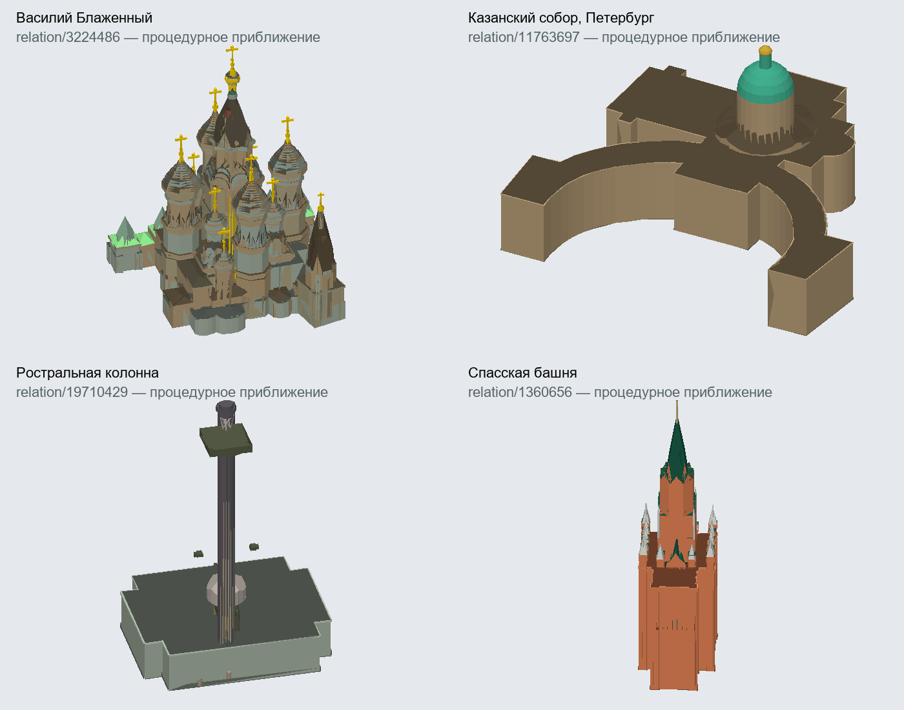

# Процедурные достопримечательности Москвы и Петербурга

Основной снимок OSM: 11 сентября 2026; первоначальная проверка: 13 сентября 2026; актуальная проверка Ростральных колонн: 20 сентября 2026. Это игровые процедурные приближения, а не точные реконструкции. GLB/авторские модели не создавались; Большеохтинский мост не моделировался. Исторические показатели ниже не заменяют проверку опубликованного S3 overlay.

## Полная инвентаризация

Прочитаны оба staging-manifest-v1.json в work/map-pilots. Файлы выбирались исключительно из всех записей манифестов, без отбора стартовых клеток. Обрабатывается один Brotli-тайл за раз; в памяти остаются ключи дедупликации, компактные метаданные объектов и частоты. NDJSON кандидатов записывается последовательно. Сверены размер файла и соответствие заявленного checksum записи манифеста полю тайла; содержимое разобрано как JSON. Повторная запись type/id не увеличивает статистику.

| Метрика | Москва | Петербург |
|---|---:|---:|
| Тайлы (план = прочитано) | 103 | 104 |
| Сжатые байты | 36105862 | 46212949 |
| Вхождения до дедупликации | 1785908 | 1529677 |
| Удалённые повторы | 1266557 | 1145448 |
| Уникальные OSM-объекты | 519351 | 384229 |
| Узлы | 432490 | 318836 |
| Ways | 78897 | 61658 |
| Отношения | 7964 | 3735 |
| Здания и части (наличие тега) | 25946 | 17725 |
| building:part (наличие тега) | 4421 | 2551 |
| Кандидаты | 16905 | 7295 |

Кандидатами считаются historic/heritage/tourism/wikidata/landmark, религиозные объекты, именованные здания, башни, дымовые трубы, обелиски, building:part и объекты с roof:shape. Категории пересекаются; Wikidata встречается также на улицах, поэтому список намеренно содержит шум. Полная ведомость охватывает также **все** здания, независимо от статуса кандидата. В Москве 15 значений building:part=no: в инвентаре они учтены как исходные записи, в рендере не считаются частями.

[Все значения, частоты, примеры обеих поставок и поведение генератора](landmark-inventory-values.md). Полные кандидаты: work/landmark-inventory/moscow-candidates.ndjson и saint-petersburg-candidates.ndjson; полные теги зданий — *-features.json, отношения со всеми участниками — *-relations.json. Эти локальные производные файлы воспроизводятся скриптом и не входят в поставку игры.

Москва: 6 711 multipolygon, 1 232 restriction, 21 building. Петербург: 3 280 multipolygon, 455 restriction, **нет type=building**. В Москве все участники отношений обнаружены; в Петербурге отсутствуют 132 участника relation/2599821 «Нева». Это отдельный пробел природного полигона, не отсутствие частей соборов.

## Матрица данных и отображения

| roof:shape | Москва | Петербург | Способ отображения | Проверенный пример Москвы | Проверенный пример Петербурга |
|---|---:|---:|---|---|---|
| barrel | 1 | 0 | Приближение через round | [way/1034107336](https://www.openstreetmap.org/way/1034107336) | Нет в поставке |
| cone | 5 | 14 | Коническая верхушка по выпуклому контуру | [way/409103118](https://www.openstreetmap.org/way/409103118) | [way/108814967](https://www.openstreetmap.org/way/108814967) |
| crosspitched | 0 | 1 | Плоская упрощённая кровля; исходный тег сохранён, точная форма неизвестна | Нет в поставке | [way/695092706](https://www.openstreetmap.org/way/695092706) |
| dome | 94 | 120 | Радиальный профиль из 5 поясов; вдали 2 | [way/282265319](https://www.openstreetmap.org/way/282265319) | [way/866992200](https://www.openstreetmap.org/way/866992200) |
| double_saltbox | 1 | 2 | Плоская упрощённая кровля; исходный тег сохранён, точная форма неизвестна | [way/52313282](https://www.openstreetmap.org/way/52313282) | [way/81112807](https://www.openstreetmap.org/way/81112807) |
| flat | 3930 | 647 | Плоская кровля по контуру с отверстиями | [way/31891570](https://www.openstreetmap.org/way/31891570) | [way/35401900](https://www.openstreetmap.org/way/35401900) |
| gabled | 1676 | 437 | Два ската, конёк вдоль/поперёк или заданный азимут | [way/47089212](https://www.openstreetmap.org/way/47089212) | [way/36220645](https://www.openstreetmap.org/way/36220645) |
| gambled | 0 | 1 | Плоская упрощённая кровля; исходный тег сохранён, точная форма неизвестна | Нет в поставке | [way/153957632](https://www.openstreetmap.org/way/153957632) |
| gambrel | 18 | 18 | Ломаная двускатная; вдали два ската | [relation/10591953](https://www.openstreetmap.org/relation/10591953) | [way/867024861](https://www.openstreetmap.org/way/867024861) |
| half-dome | 1 | 1 | Плоская упрощённая кровля; исходный тег сохранён, точная форма неизвестна | [way/831219114](https://www.openstreetmap.org/way/831219114) | [way/1331069820](https://www.openstreetmap.org/way/1331069820) |
| half-hipped | 2 | 3 | Полувальма с укороченными торцевыми скатами | [way/84690589](https://www.openstreetmap.org/way/84690589) | [way/147152580](https://www.openstreetmap.org/way/147152580) |
| hipped | 2859 | 336 | Четыре ската с коньком | [way/31137112](https://www.openstreetmap.org/way/31137112) | [way/35133504](https://www.openstreetmap.org/way/35133504) |
| mansard | 38 | 8 | Ломаная четырёхскатная; вдали простая вальма | [way/113653316](https://www.openstreetmap.org/way/113653316) | [way/197658139](https://www.openstreetmap.org/way/197658139) |
| many | 129 | 36 | Плоская упрощённая кровля; исходный тег сохранён, точная форма неизвестна | [way/79581616](https://www.openstreetmap.org/way/79581616) | [way/36220854](https://www.openstreetmap.org/way/36220854) |
| mixed | 1 | 0 | Плоская упрощённая кровля; исходный тег сохранён, точная форма неизвестна | [relation/19044120](https://www.openstreetmap.org/relation/19044120) | Нет в поставке |
| onion | 67 | 16 | Радиальный профиль с расширением 12%; вдали 3 пояса | [way/228691388](https://www.openstreetmap.org/way/228691388) | [way/117478061](https://www.openstreetmap.org/way/117478061) |
| plants | 13 | 0 | Плоская упрощённая кровля; исходный тег сохранён, точная форма неизвестна | [way/1064100922](https://www.openstreetmap.org/way/1064100922) | Нет в поставке |
| pyramidal | 256 | 77 | Пирамида по двум осям габарита | [way/227755297](https://www.openstreetmap.org/way/227755297) | [way/59177321](https://www.openstreetmap.org/way/59177321) |
| quadruple_saltbox | 20 | 6 | Плоская упрощённая кровля; исходный тег сохранён, точная форма неизвестна | [way/79685518](https://www.openstreetmap.org/way/79685518) | [way/60974105](https://www.openstreetmap.org/way/60974105) |
| round | 263 | 59 | Свод из 6 секций; вдали два ската | [way/1240556467](https://www.openstreetmap.org/way/1240556467) | [way/55441206](https://www.openstreetmap.org/way/55441206) |
| round_gabled | 0 | 1 | Плоская упрощённая кровля; исходный тег сохранён, точная форма неизвестна | Нет в поставке | [way/23002927](https://www.openstreetmap.org/way/23002927) |
| round_skillion | 1 | 0 | Плоская упрощённая кровля; исходный тег сохранён, точная форма неизвестна | [way/781833202](https://www.openstreetmap.org/way/781833202) | Нет в поставке |
| saltbox | 15 | 0 | Несимметричная двускатная (оценка смещения конька 35%) | [way/52609073](https://www.openstreetmap.org/way/52609073) | Нет в поставке |
| side_hipped | 1 | 50 | Приближение через hipped; асимметрия утрачена | [way/151060792](https://www.openstreetmap.org/way/151060792) | [way/43196869](https://www.openstreetmap.org/way/43196869) |
| skillion | 353 | 90 | Один скат, снижение по направлению стока | [way/1201651273](https://www.openstreetmap.org/way/1201651273) | [way/59807560](https://www.openstreetmap.org/way/59807560) |

Контуры с отверстиями проходят earcut и отсечение скатами, дворы остаются открытыми. Dome/onion/cone применяются к выпуклому одиночному контуру до 64 вершин; при вогнутости, отверстиях или превышении лимита применяется плоская кровля. Pyramidal/hipped определяются по габариту в выбранных осях, а не по полноценному straight skeleton; сложные планы остаются приближением. Round имеет шесть секций вблизи. Saltbox использует фиксированное смещение конька, half-hipped — оценённую высоту торцевого ската. Индивидуальные уклоны, барабаны и количество глав не изобретаются, если их нет отдельными частями.

Высота крыши: roof:height → roof:angle и пролёт → roof:levels × 3 м → размер контура/оценка. Roof:height может занимать всю высоту части; height включает крышу. roof:direction трактуется как направление стока, численно или 16 румбами; иначе along/across и длинное ребро. Правила основаны на [OSM Simple 3D Buildings](https://wiki.openstreetmap.org/wiki/Simple_3D_Buildings) и [roof:direction](https://wiki.openstreetmap.org/wiki/Key:roof:direction). Значения со списками, опечатками и неоднозначными единицами не превращаются в произвольные числа.

Явный цвет крыши имеет приоритет над палитрой материала, затем используется приглушённый фасад. Поддержаны hex и встречающиеся стандартные названия цветов; нестандартные greeny, rgey, rose, dark_brown, списки через точку с запятой дают стабильный fallback. Фасадные материалы остаются тремя игровыми стилями. Металл, позолота и камень не получают физически точного блеска/фактуры. Все исходные теги сохраняются в Building.osmTags, в том числе пока не интерпретируемые roof:min_height, roof:min_level, building:architecture, cladding и нестандартные описания деталей.

## Составные объекты и пробелы поставки

Группы строятся из outline/part в type=building (с вложенностью и защитой от циклов) или из геометрического включения частей в значимое здание. Один Wikidata/имя или соседство не объединяют ансамбль. Пространственный поиск ограничен якорями до 1,5 км; части в отверстиях исключаются. Неименованные обычные дворы продолжают отфильтровываться. Фильтр сохраняет группу и доступные зависимости way/node/relation целиком, roads-режим остаётся дорожным.

Оболочка с общей высотой не закрывает отдельно описанные башни: envelopeHeight отмечает оценённое основание по ярусам. Для пространственной группы широкий ярус предпочтительнее маленького карниза. Исходный height остаётся неизменным; это **эвристика заполнения неполной оболочки**, а не измеренная высота. Неполные данные всё ещё могут оставлять разрывы или упрощённые объёмы. Полное покрытие наземными частями по-прежнему заменяет оболочку; частичное покрытие обычного здания её не удаляет.

Локальные PBF сравнены через отдельные диагностические XML. Следующая таблица — исторический срез на 13 сентября: она показывает геометрических кандидатов building:part **в bounding box оболочки**, а не доказанное семантическое членство. У вложенных ансамблей, особенно дворца, возможны пересечения и соседние комплексы. Данные о Ростральных колоннах из этой таблицы заменены актуальной проверкой S3 ниже.

| Объект | OSM | Части-кандидаты в PBF | Из них в поставке | Только в PBF, примеры |
|---|---|---:|---:|---|
| Ростральная колонна | [relation/19710429](https://www.openstreetmap.org/relation/19710429) | 201 | 73 | [relation/19710430](https://www.openstreetmap.org/relation/19710430), [relation/19710431](https://www.openstreetmap.org/relation/19710431), [relation/19710432](https://www.openstreetmap.org/relation/19710432) |
| Ростральная колонна | [relation/3084697](https://www.openstreetmap.org/relation/3084697) | 201 | 73 | [relation/3084701](https://www.openstreetmap.org/relation/3084701), [relation/19708253](https://www.openstreetmap.org/relation/19708253), [relation/19708254](https://www.openstreetmap.org/relation/19708254) |
| Казанский собор | [relation/11763697](https://www.openstreetmap.org/relation/11763697) | 3 | 3 | Нет в проверенной области |
| Собор Василия Блаженного | [relation/3030568](https://www.openstreetmap.org/relation/3030568) | 513 | 503 | [relation/16337989](https://www.openstreetmap.org/relation/16337989), [relation/19064615](https://www.openstreetmap.org/relation/19064615), [relation/19064616](https://www.openstreetmap.org/relation/19064616) |
| Собор Михаила Архангела | [relation/1359243](https://www.openstreetmap.org/relation/1359243) | 99 | 63 | [relation/3060978](https://www.openstreetmap.org/relation/3060978), [relation/3060979](https://www.openstreetmap.org/relation/3060979), [relation/3060980](https://www.openstreetmap.org/relation/3060980) |
| Благовещенский собор | [relation/1359251](https://www.openstreetmap.org/relation/1359251) | 66 | 19 | [relation/3062958](https://www.openstreetmap.org/relation/3062958), [relation/3062959](https://www.openstreetmap.org/relation/3062959), [relation/3062960](https://www.openstreetmap.org/relation/3062960) |
| Успенская звонница | [relation/1359278](https://www.openstreetmap.org/relation/1359278) | 52 | 34 | [relation/3059065](https://www.openstreetmap.org/relation/3059065), [relation/3059066](https://www.openstreetmap.org/relation/3059066), [relation/3059067](https://www.openstreetmap.org/relation/3059067) |
| Церковь Иоанна Лествичника | [relation/1359281](https://www.openstreetmap.org/relation/1359281) | 17 | 16 | [relation/3059074](https://www.openstreetmap.org/relation/3059074) |
| Собор Успения Пресвятой Богородицы | [relation/3028585](https://www.openstreetmap.org/relation/3028585) | 15 | 0 | [relation/3028594](https://www.openstreetmap.org/relation/3028594), [relation/3058445](https://www.openstreetmap.org/relation/3058445), [relation/3058446](https://www.openstreetmap.org/relation/3058446) |
| Большой Кремлёвский дворец | [relation/225033](https://www.openstreetmap.org/relation/225033) | 337 | 56 | [relation/3049124](https://www.openstreetmap.org/relation/3049124), [relation/3049127](https://www.openstreetmap.org/relation/3049127), [relation/3049128](https://www.openstreetmap.org/relation/3049128) |
| Спасская башня | [relation/1360656](https://www.openstreetmap.org/relation/1360656) | 81 | 78 | [relation/3271041](https://www.openstreetmap.org/relation/3271041), [relation/3271042](https://www.openstreetmap.org/relation/3271042), [relation/3271043](https://www.openstreetmap.org/relation/3271043) |

Казанский собор Петербурга: relation/11763697 — оболочка высотой 22 м; way/827660972 — купол 22–47,6 м, roof:height=10, зелёная кровля; way/1042588710 — верхушка 47–55 м, onion высотой 3 м и материал gold; way/1043505419 — отдельная пирамидальная часть. Все три сохранены группой и проверяются тестом. Отдельная колоннада с колоннами в этой поставке не описана; её широкий контур остаётся экструзией. Четыре одноимённых узла и два одноимённых отношения из диагностического PBF не следует автоматически считать частями собора.

Ростральные колонны: исторические 73 части в таблице выше относятся к поставке до overlay и больше не описывают опубликованную игру. В активном S3-каталоге первым стоит `saint-petersburg-parts-20260919`; он перекрывает тайлы `15/19142/9525`, `15/19142/9526`, `15/19143/9525` и `15/19143/9526`. В ключевом тайле `15/19142/9526` присутствуют обе оболочки relation/19710429 и relation/3084697, а при построении мира каждая получает **201 часть**. В том числе в артефакте есть relation/19710430, relation/19710431, relation/19710432, relation/3084701, relation/19708253 и relation/19708254. Клиент в проверенном запуске взял эти тайлы из S3, а не IndexedDB: S3 проверяется раньше кэша, а в логе у тайлов указан `source: s3`.

Исправленный дефект — не потеря `building:part`, а интерпретация высот. У обеих колонн 42 частей с `building:part=roof`; 41 из них имеют абсолютный тег `height`, но не имеют `min_height`. Для такой части рендер теперь использует `height - roof:height`, если `roof:height` задана; иначе ищет содержащий опорный ярус в той же группе, а при его отсутствии оставляет тонкую верхнюю крышку. Например, relation/19713271 с `height=31.80` и `roof:height=1.80` начинается на 30 м, а не на земле. Явные `min_height` и `building:min_level` не меняются. Добавление ещё одних source-тайлов для этого не требуется.

Окна — второй исправленный дефект. Сами roof-части исключены из фасадов, но у каждой колонны 180 конструктивных частей размечены обобщённо как `building:part=yes`. Для таких частей действует общее правило: по умолчанию процедурных окон нет; они разрешаются только явным тегом окна либо наследованием от обычного фасадного типа родительской группы (apartments, house, commercial, retail, office, hotel, school, hospital, residential или dormitory). Поэтому правило не привязано к названию или типу конкретного памятника, но не добавляет жилые окна конструктивным частям.

Василий Блаженный: relation/3224486 type=building содержит 518 участников, включая оболочку relation/3030568 и части-отношения. В сохранённой области 503 части, десять дополнительных отношений есть только в PBF. У сохранённых частей **нет roof:shape=dome/onion**: формы собираются из многих контуров, round, pyramidal и других скатов. Это важный контрпример подходу «один собор — один купол». Все 503 части сохраняют связь с группой; несколько отдельных башен не заменяются одной.

Кремль проверен как набор объектов, а не один полигон: Спасская башня, Архангельский/Благовещенский/Успенский соборы, Успенская звонница, Большой Кремлёвский дворец и колокольня Ивана Великого. Последняя записана как «Церковь Иоанна Лествичника», relation/1359281. У Успенского собора присутствует оболочка, но все 15 найденных в PBF частей отсутствуют в тайлах. У Спасской башни отсутствуют три важные части-отношения, включая нижний корпус. Данные годятся для приближённых силуэтов, не для восстановления архитектуры целиком.

## LOD и стоимость

Вблизи сохраняются все части, основные профили крыш и отдельные верхушки. Групповые детали не получают лишние фасадные полосы и окна; window=no учитывается. У мелких частей менее 6 × 6 м и менее 3 м по высоте профиль сразу упрощён. Вдали нет фасадных полос, round/gambrel/mansard используют меньше скатов, dome/onion меньше поясов; декор группы меньше 2 × 2 × 2 м опускается. Узкая высокая башня остаётся, число крупных глав не сокращается. Материалы/меши объединяются в прежние batches: отдельного draw call на каждый купол нет.

| Реальный сценарий на историческом снимке 13 сентября | Геометрических частей/оболочек | Треугольники вблизи | Вдали | Буферы вблизи, КиБ |
|---|---:|---:|---:|---:|
| Казанский собор (relation/7624254) | 10 | 1174 | 674 | 114 |
| Храм Василия Блаженного (relation/3224486) | 504 | 23611 | 12493 | 2303 |
| Спасская башня (relation/1360656) | 79 | 3752 | 2432 | 358 |
| Собор Михаила Архангела (relation/1359243) | 64 | 9707 | 4307 | 1019 |
| Благовещенский собор (relation/1359251) | 19 | 3205 | 1933 | 314 |
| Успенская звонница (relation/1359278) | 20 | 2226 | 1394 | 232 |
| Церковь Иоанна Лествичника (relation/1359281) | 17 | 2114 | 1286 | 222 |
| Собор Успения Пресвятой Богородицы (relation/3028585) | 1 | 2253 | 613 | 217 |
| Большой Кремлёвский дворец (relation/225033) | 36 | 3239 | 1555 | 317 |
| Казанский собор (relation/11763697) | 4 | 1919 | 823 | 185 |
| Ростральная колонна (relation/19710429) | 74 | 4536 | 1181 | 438 |
| Ростральная колонна (relation/3084697) | 74 | 4412 | 962 | 427 |

Это меши зданий без дорожных вырезов, на ровном основании, с 32-битными indices и float32 position/normal/color/UV; память JS-массивов, текстуры, дороги, машины, тени и рельеф не включены. Локальные CPU-замеры — настольный Windows, не FPS телефона. В тестах установлены регрессионные пороги: 30 000 треугольников на выбранный ансамбль, 200 000 / 32 МиБ строительных буферов для проверенного мобильного набора кварталов. Они не являются измерением производительности конкретного телефона или обещанием для любой точки города.

| Мобильный старт | Клетки | Сырые элементы | После фильтра | Режим | Кварталы | Треугольники зданий | Максимум в квартале | Буферы, МиБ |
|---|---:|---:|---:|---|---:|---:|---:|---:|
| moscow | 25 | 238072 | 155754 | minimal | 32 | 143379 | 28311 | 13.75 |
| saint-petersburg | 36 | 189755 | 173064 | standard | 32 | 67257 | 7199 | 6.44 |

Журнал Android от 20 сентября показал, что S3 не является узким местом: 36 тайлов были готовы за 31,3 с, после чего построение мира из 161114 объектов заняло ещё 36,1 с. Поэтому блокирующий радиус `mobile` уменьшен с 1,5 до 1 км; целевой радиус 2,5 км и догрузка по ходу движения сохранены. Это уменьшает объём первого мира и оставляет дальние клетки фоновой работой. Лимит 180000 и исходные tile/cache версии не менялись.

## Что требует авторской модели

Для точного узнаваемого декора всё ещё нужны авторские модели: Василий Блаженный (узоры, рёбра и неодинаковые главы), Казанский собор (колоннада, портики, ордера), обе Ростральные колонны (ростры и скульптуры), Спасская башня (часы, звезда, декоративные ярусы), соборы и дворцы Кремля (детали фасадов и точная пластика). Для Ростральных колонн исходных частей теперь достаточно для процедурного силуэта после исправления интерпретации roof-face; проблема не в отсутствии полного ствола в S3. У Успенского собора в текущей поставке нет даже процедурного набора частей: улучшить его силуэт можно только отдельной будущей поставкой данных либо моделью. Большеохтинский мост также требует отдельной работы по фермам и башням; она намеренно не выполнялась.

Не каждый указанный объект требует модели для дешёвого игрового силуэта: множество отдельных глав и ярусов уже рисуются из данных. Таблица выше разделяет отсутствие данных, упрощённое отображение и декоративную точность. Скульптурные node/POI без строительного контура не получают выдуманную форму.

## Воспроизведение и проверки

1. node scripts/inventory-landmarks.mjs — все 207 тайлов, NDJSON и частоты.
2. node scripts/landmark-fixtures.mjs — выбор реальных форм из полного инвентаря, сохранение зависимостей и сценариев ансамблей.
3. Для PBF: osmium extract --bbox W,S,E,N --strategy smart --option types=any INPUT.osm.pbf --output-format osm -o work/landmark-inventory/NAME-source.osm; области: rostral=30.300,59.939,30.312,59.948; kazan=30.322,59.932,30.327,59.937; kremlin=37.611,55.746,37.625,55.756. Затем python scripts/compare-landmark-pbf.py.
4. В PowerShell: $env:LANDMARK_PROFILE='1'; npx vitest run scripts/landmark-budget.local.test.ts.
5. python scripts/preview-landmark-meshes.py (Pillow, Windows Arial); node scripts/report-landmarks.mjs.
6. npm test; npm run typecheck; npm run lint; npm run build; проверка fix-mojibake.ps1 -Root . -WhatIf.

Тесты покрывают формы, высоту/угол/азимут/цвет, неизвестные значения, отверстия, несколько башен, вложенные и циклические отношения, разделение type/id, сохранение Казанской верхушки, полное покрытие и мобильный бюджет. Интеграционные JSON работают без локальных PBF/тайлов; тест полного старта пропускается только при отсутствии локальных поставок.

Диагностическая проекция тех же мешей без текстур, рельефа и освещения Babylon. Для Ростральных колонн это исторический результат до S3 overlay; его пробелы нельзя использовать как доказательство отсутствия крупных частей в текущей поставке.

Данные © участники OpenStreetMap, ODbL 1.0. Fixture и отчёты — производные данные локальных снимков, атрибуция сохранена.
